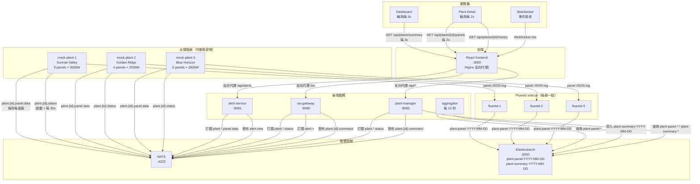
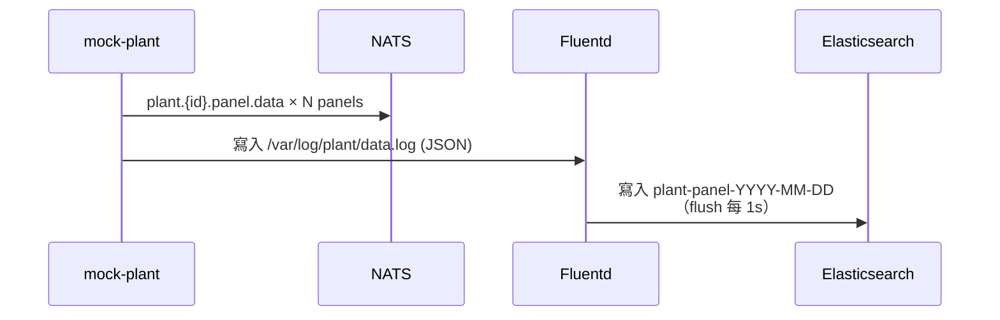
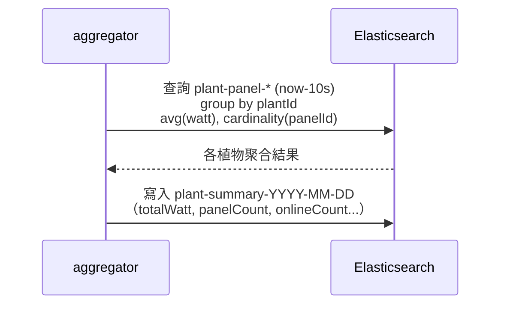
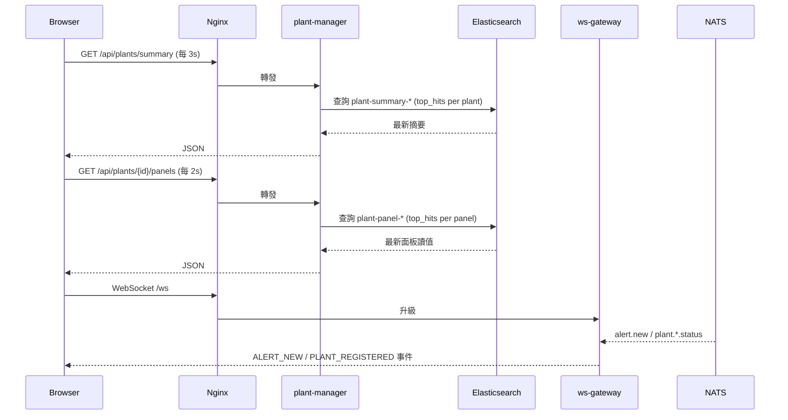
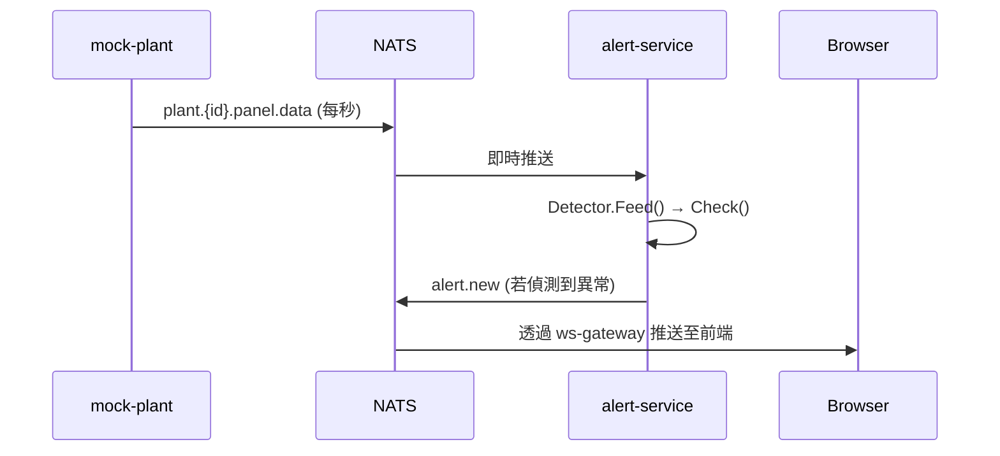
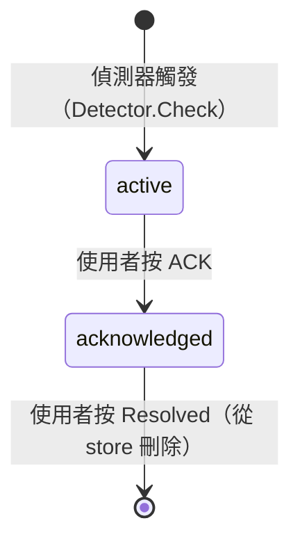
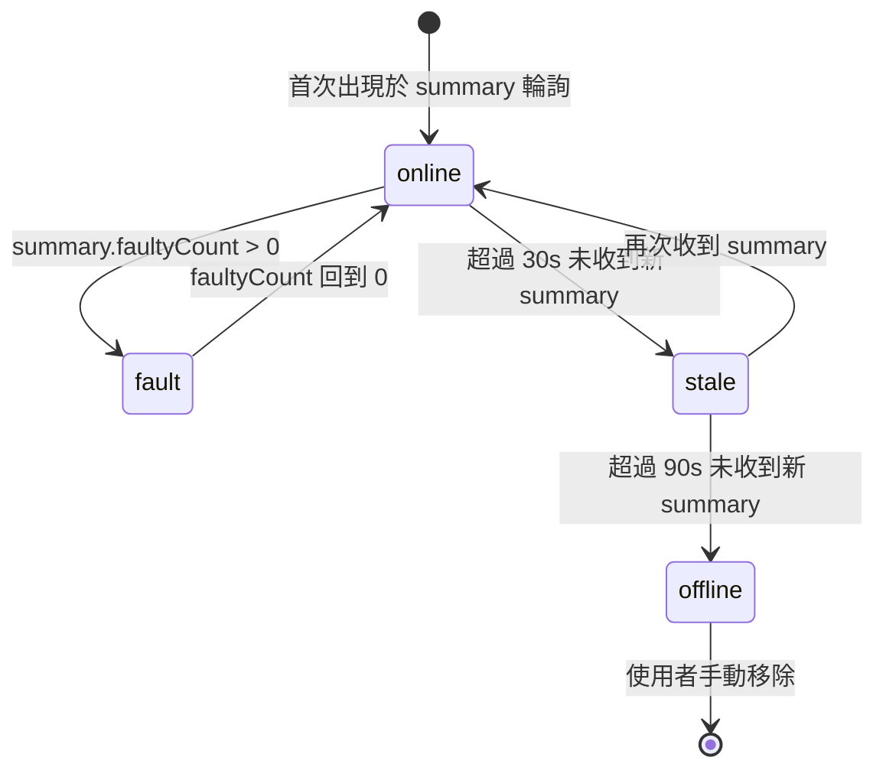
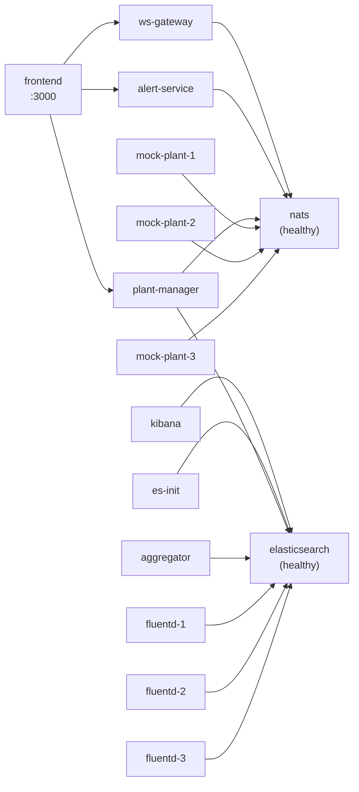

# SolarOps 系統架構文件

> 最後更新：2026-03-31

## 系統概覽

SolarOps 是一個太陽能電廠即時監控平台。分散各地的太陽能廠每秒產生發電資料，透過 Fluentd 寫入 Elasticsearch；後端服務負責聚合、告警與指令控制；前端透過 REST 輪詢資料、WebSocket 接收事件。

### 設計原則

- **NATS = 事件通道**：植物狀態、告警、操控指令
- **Elasticsearch = 資料倉儲**：所有原始讀值與聚合摘要，按日分 index
- **前端輪詢**：儀表板每 3 秒拉取摘要；面板詳情每 2 秒拉取最新讀值

---

## 服務清單

| 服務 | 語言 | Port | 說明 |
|------|------|------|------|
| `mock-plant` | Go | — | 模擬太陽能廠，每秒發布資料 |
| `ws-gateway` | Go | 8080 | WebSocket 閘道，橋接 NATS ↔ 前端 |
| `alert-service` | Go | 8081 | 即時告警偵測與管理 |
| `plant-manager` | Go | 8082 | 植物生命週期管理、ES 查詢 API |
| `aggregator` | Go | — | 每 10 秒從 ES 聚合摘要並寫回 ES |
| `frontend` | React/TS | 3000 | 監控儀表板（Nginx 反向代理） |
| `elasticsearch` | — | 9200 | 資料倉儲 |
| `nats` | — | 4222 | 訊息匯流排 |
| `fluentd` | — | — | 日誌採集，每個植物一個 sidecar |
| `kibana` | — | 5601 | ES 資料視覺化（開發用） |

---

## 整體架構圖



---

## 資料流

### 1. 資料寫入流程（每秒）



### 2. 聚合流程（每 10 秒）



### 3. 前端資料取得流程



### 4. 告警偵測流程



---

## NATS 主題對應

| 主題 | 方向 | 說明 |
|------|------|------|
| `plant.{id}.status` | mock-plant → NATS | 植物上線狀態，啟動時 + 每 30s 心跳 |
| `plant.{id}.panel.data` | mock-plant → NATS | 每秒每面板讀值（PanelReading） |
| `plant.{id}.command` | NATS → mock-plant | 操控指令：OFFLINE / ONLINE / RESET / FAULT |
| `alert.new` | alert-service → NATS | 新告警觸發 |

---

## Elasticsearch Index 結構

### `plant-panel-YYYY-MM-DD`（Fluentd 寫入）

每秒每面板一筆，由 Fluentd logstash_format 按日建立。

| 欄位 | 類型 | 說明 |
|------|------|------|
| `@timestamp` | date | Fluentd 事件時間，供 ES/Kibana 查詢使用 |
| `timestamp` | date | PanelReading struct 原始時間，供前端 TypeScript 使用 |
| `plantId` | keyword | 植物 UUID |
| `plantName` | keyword | 植物名稱 |
| `panelId` | keyword | 面板 UUID |
| `panelNumber` | integer | 面板編號 |
| `status` | keyword | `online` / `offline` |
| `faultMode` | keyword | 故障模式（正常時欄位不存在） |
| `watt` | float | 當下發電量（瓦） |

### `plant-summary-YYYY-MM-DD`（aggregator 寫入）

每 10 秒每植物一筆。

| 欄位 | 類型 | 說明 |
|------|------|------|
| `@timestamp` | date | 聚合時間，供 ES/Kibana 查詢使用 |
| `timestamp` | date | 聚合時間，供前端 TypeScript 使用（與 @timestamp 同值） |
| `plantId` | keyword | 植物 UUID |
| `plantName` | keyword | 植物名稱 |
| `totalWatt` | float | 瞬間總發電量（avg_watt × panelCount） |
| `panelCount` | integer | 面板總數（cardinality） |
| `onlineCount` | integer | 線上面板數 |
| `offlineCount` | integer | 離線面板數 |
| `faultyCount` | integer | 故障面板數 |

### 時間欄位說明

兩個 index 都同時保有 `@timestamp` 和 `timestamp`：
- **`@timestamp`**：ES 生態系標準欄位，Kibana、ILM、跨 index 查詢預設使用
- **`timestamp`**：前端 TypeScript 友善名稱（`summary.timestamp` vs `summary["@timestamp"]`）

---

## 資料生命週期（ILM）

| Index Pattern | 保留天數 | 估計資料量 |
|---------------|---------|-----------|
| `plant-panel-*` | 7 天 | ~130 萬筆/天（3 廠 × 5 面板 × 86400 秒） |
| `plant-summary-*` | 30 天 | ~26000 筆/天（3 廠 × 8640 筆/10 秒） |

ILM policy 由 `es-init` 容器在啟動時建立，新建的 index 自動套用。
修改 template 不影響既有 index；開發環境可用 `docker compose down -v` 重建使其生效。

---

## Plant Manager API

| Method | Path | 說明 |
|--------|------|------|
| `GET` | `/api/plants` | 列出已知植物（registry） |
| `POST` | `/api/plants` | 新增植物（啟動 Docker container） |
| `DELETE` | `/api/plants/{plantId}` | 刪除植物（停止 container） |
| `GET` | `/api/plants/summary` | 儀表板輪詢：查 `plant-summary-*` top_hits |
| `GET` | `/api/plants/{plantId}/panels` | 面板詳情輪詢：查 `plant-panel-*` top_hits |
| `GET` | `/api/plants/{plantId}/history` | 歷史功率曲線：date_histogram |
| `POST` | `/api/plants/{plantId}/panels/{panelId}/fault` | 觸發面板故障指令 |

---

## Alert Service API

| Method | Path | 說明 |
|--------|------|------|
| `GET` | `/api/alerts` | 列出告警，可加 `?status=active\|acknowledged` 過濾 |
| `POST` | `/api/alerts/{id}/acknowledge` | 確認告警（active → acknowledged） |
| `POST` | `/api/alerts/{id}/resolve` | 解除告警（從 store 刪除） |

### 告警偵測規則

偵測器對每個面板保留最新 20 筆讀值（滑動視窗），每次收到新讀值後執行檢查：

| 告警類型 | 觸發條件 | 參數 |
|---------|---------|------|
| `PANEL_FAULT` | 末尾連續 0W 讀值達閾值 | 3 次 |
| `PANEL_DEGRADED` | 視窗首筆→末筆發電量下降比例超閾值 | ≥ 30% |
| `PANEL_UNSTABLE` | 視窗內 0W ↔ 非 0W 翻轉次數超閾值 | ≥ 5 次 |

相同 `(plantId, panelId, type)` 組合若已有 active/acknowledged 告警，則不重複建立。

### 告警工作流程



> **注意**：`alert.resolved` NATS 主題目前未使用——告警解除僅透過 REST API 手動操作，不會自動廣播至前端。ws-gateway 已訂閱該主題備用，待未來實作自動解除邏輯時可啟用。

---

## 前端狀態機



---

## Docker Compose 服務拓撲



---

## 動態新增植物

系統支援不停機新增植物：

1. 呼叫 `POST /api/plants` → plant-manager 啟動新 Docker container
2. 新 container 連接 NATS，發布 `plant.{id}.status`
3. plant-manager 與 ws-gateway 訂閱到狀態，前端收到 `PLANT_REGISTERED` 事件
4. Fluentd **需手動新增** sidecar（或透過 compose 動態 up）寫入 ES
5. 前端 3s 後的下一次 summary 輪詢即可看到新植物資料

> 注意：動態啟動的 mock-plant container 沒有配對的 Fluentd sidecar，
> 因此不會有資料寫入 ES，只有 NATS 事件可用。完整支援需擴充 plant-manager 動態啟動 Fluentd。

---

## 模組結構

```
solarops/
├── go.work                      # Go workspace (go 1.25.0)
├── shared/                      # 共用 models (PlantInfo, PanelReading, PlantSummary, Command...)
├── services/
│   ├── mock-plant/              # 模擬電廠
│   │   ├── plant/               # Plant struct, GeneratePanelReadings(), HandleCommand()
│   │   └── logger/              # 寫入 JSON log 供 Fluentd 採集
│   ├── ws-gateway/
│   │   └── hub/                 # WebSocket client 管理（broadcast channel）
│   ├── alert-service/
│   │   ├── detector/            # 異常偵測邏輯
│   │   └── store/               # 告警記憶體儲存
│   ├── plant-manager/           # 植物 registry + Docker API + ES 查詢
│   └── aggregator/              # ES 讀取聚合 → 摘要寫回
├── frontend/
│   └── src/
│       ├── hooks/usePlants.ts   # 輪詢 + 告警狀態管理
│       ├── hooks/useWebSocket.ts
│       ├── pages/Dashboard.tsx  # 儀表板（植物卡、告警、功率圖）
│       └── pages/PlantDetail.tsx # 面板詳情 + 歷史功率圖
└── infra/
    ├── elasticsearch/           # Index template 初始化腳本
    └── fluentd/                 # fluent.conf + Dockerfile
```
